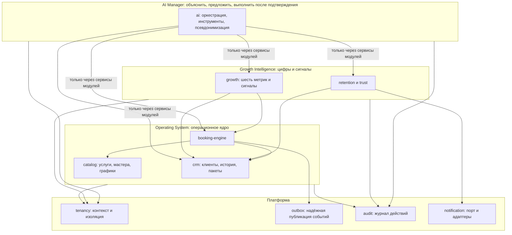
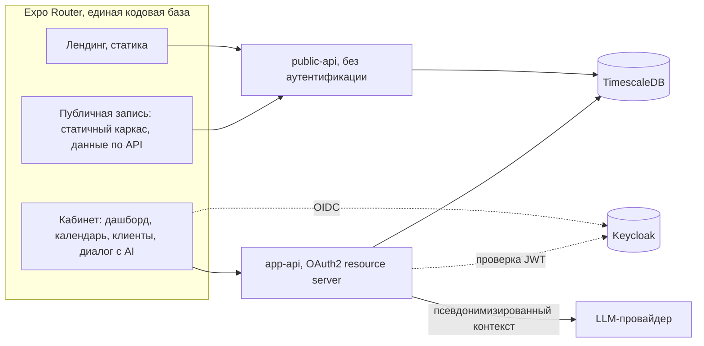

# Cadence — план продукта и реализации

AI-первый бизнес-менеджер для соло-специалистов и микро-команд: модульный монолит на Java 25 / Spring Boot 4.1, универсальный фронтенд на Expo + React Native Web, три слоя (операционный, аналитический, AI) и порядок работ от вертикального среза записи к метрикам, AI-менеджеру и ретеншну.

## 1. Цели продукта и границы MVP

Продукт решает три боли соло-специалиста и микро-команды до 5 мастеров: запись отнимает время в переписке, клиенты не возвращаются, а решения о росте принимаются на ощущениях.

Цели MVP:

- Владелец за один вечер настраивает услуги, график и получает работающую страницу записи.
- Клиент записывается за три решения — услуга, мастер, слот — плюс контакт и экран подтверждения. Без регистрации и без установки приложения.
- Каждый визит автоматически формирует профиль клиента и историю, без ручного ведения таблиц.
- Владелец видит шесть метрик с воспроизводимыми определениями и получает от AI объяснение, что именно с ними делать.

Вне границ MVP, но в роадмапе. Это не «никогда», а «не сейчас»: реализация запрещена до завершения фазы 5, но архитектурные швы под неё сохраняются заранее (см. раздел 3.2).

- Интеграции с Altegio, соцсетями, Google и Apple Calendar.
- Эквайринг, онлайн-оплата, депозиты, возвраты, фискализация.
- Выделение сервисов из монолита, внешние брокеры сообщений, отдельные БД на модуль, Kubernetes.
- Публикация мобильных приложений в App Store и Google Play. В MVP iOS и Android собираются и проверяются на устройстве, но не публикуются.
- Машинное обучение в оценке оттока и доверия. Обе оценки в MVP только rule-based и объяснимые.

Внутри границ MVP: многоязычность. Целевые локали — русский, английский, грузинский, украинский, чешский. Инфраструктура рассчитана на все пять сразу, полностью переведены в MVP русский и английский, остальные три добавляются как контент без изменения кода (см. раздел 9).

## 2. Зафиксированные решения

Эти решения не пересматриваются в процессе реализации без явного запроса:

- Арендатор поддерживает 1..N мастеров с первого дня, модель данных resource-centric, UI оптимизирован под 1-5 мастеров. Соло-специалист — вырожденный случай, а не отдельная схема.
- Канал коммуникации с клиентом — Telegram-бот, единственное разрешённое исключение из запрета на интеграции. Для клиентов без Telegram обязателен fallback: задача владельцу на ручную отправку с готовым текстом.
- AI имеет право на чтение и на черновики действий, каждое изменяющее действие требует подтверждения владельца и проходит ту же валидацию Booking Engine, что и UI.
- Фронтенд: единый Expo Router проект, NativeWind v4 плюс собственный пакет токенов и примитивов, календарь пишется с нуля. Лендинг статичен, страница публичной записи — статичный каркас с динамической загрузкой данных.
- Движения денег в системе нет: эквайринга не существует, пакеты услуг и оплаты — учётные записи, которые владелец отмечает вручную. No-show сдерживается только правилами Trust.
- Клиент опознаётся по нормализованному телефону E.164 как ключу сопоставления, без аккаунта и без OTP. Защита — rate limit и подтверждение владельцем. Идентичностью клиента является `client.id` (UUID), а не телефон.
- Аутентификация сотрудников — Keycloak (OAuth2 / OIDC), один realm, `tenant_id` и роли `OWNER` / `MASTER` приходят claim'ами через protocol mapper. Публичные маршруты записи остаются неаутентифицированными.
- В ПДн-контур LLM уходят только псевдонимизированные данные: имена, фамилии и телефоны заменяются токенами, свободные текстовые поля маскируются, обратная подстановка выполняется на бэкенде.
- Окружение — Docker Compose (TimescaleDB, Keycloak, бэкенд) локально и на одном VPS.
- Календарь в фазе 1 без drag-and-drop: клик по слоту открывает панель визита, перенос — через диалог выбора слота.
- Ядро Growth Engine — шесть метрик: загрузка слотов, доля повторных записей, средний интервал возврата, no-show rate, стоимость выполненных услуг на отработанный час, риск оттока клиента.
- Локализация: инфраструктура на пять локалей (ru, en, ka, uk, cs) с первого дня, в MVP полностью переведены ru и en. Добавление ka, uk, cs не должно требовать правок кода — только файлов сообщений.
- Деньги: одна валюта на арендатора, код ISO-4217 в настройках, все суммы хранятся целым числом в минорных единицах. Мультивалютности внутри арендатора и курсов конвертации нет.
- Целевой стек фиксируется точной версией: Java 25 LTS и Spring Boot 4.1.x. Spring Boot 4.0 не берём: его OSS-поддержка заканчивается 31 декабря 2026, а 4.1 вышел 10 июня 2026 на том же Spring Framework 7 и Spring Security 7.
- Метрики реализуются раньше AI. Порядок работ: операционный срез, затем Metrics Core, затем AI-менеджер, затем ретеншн, затем продвинутые сигналы (см. раздел 12).
- Код: слоистый модульный монолит (порты и адаптеры — см. 3.1 и 3.3), явные паттерны вместо ad-hoc. Запрещены анемичные «менеджеры» на тысячи строк и прямой SQL вне jOOQ-репозиториев своего модуля.
- Персистентность: только jOOQ + Flyway, без JPA/Hibernate. Схема Flyway — источник истины; `jooq-codegen` из схемы выполняется в CI. Tenancy: явный `tenant_id` в каждом запросе + `SET LOCAL` + RLS (жёсткий барьер), без Hibernate-фильтра.
- СУБД: TimescaleDB (PostgreSQL-совместимость), образ `timescale/timescaledb` в Docker Compose. Операционные таблицы (каталог, клиенты, `appointment` с GiST exclusion на `occupied_range`) остаются обычными. Hypertables только для временных рядов: журнал событий бронирования, снимки метрик, audit log, журнал доставки уведомлений. Outbox **не** hypertable: частые `UPDATE processed_at` плохо ложатся на chunks.
- Spring Batch и Spring Integration — по задаче, не оба сразу «на будущее». **Spring Batch**, если работа перезапускаемая, с чекпоинтами, по порциям (арендатор / день / чанк событий) и нужна сетка «все tenant’ы за окно» (метрики, GDPR-анонимизация, массовый пересчёт Trust). **Spring Integration**, если работа — поток сообщений и адаптеры (опрос outbox → канал → Telegram/ручная задача), без тяжёлого rewind по чанкам. Не использовать Batch для одного HTTP-запроса и не использовать Integration как замену доменным сервисам. В фазе 1A outbox-поллер — `@Scheduled` + jOOQ; Batch входит в фазе 2; Integration — когда появляются каналы (фаза 4) или если поллер outbox обрастёт адаптерами.

## 3. Архитектура

Продукт осознанно состоит из трёх слоёв, и это разделение отражено в модулях, а не только в маркетинге. AI — это верхний слой объяснения и предложения действий, а не место, где живёт бизнес-логика.





### 3.1 Правила границ модулей

Проверяются тестом архитектуры (ArchUnit), падение теста блокирует сборку:

- Модуль общается с другим модулем только через его публичный сервисный интерфейс и DTO. Пакет `internal` недоступен извне.
- Ни один репозиторий не покидает границу своего модуля.
- Нет доступа к таблицам другого модуля и нет SQL вне jOOQ DAO своего модуля.
- Модуль `ai` не имеет ни одной зависимости на репозитории и на сгенерированные jOOQ-таблицы. Только на сервисные порты.
- Все запросы к БД выполняются в контексте `TenantContext`, установленного фильтром или явно переданного в асинхронную задачу.
- Ни один модуль не пишет в таблицы другого модуля напрямую, включая `outbox` и `audit` — для них есть сервисы платформы.

### 3.2 Швы под роадмап: что готовим сейчас, не реализуя

Смысл шва — чтобы будущая интеграция стоила один адаптер, а не переписывание домена. Реализовывать адаптеры в MVP запрещено, но следующее закладывается сразу:

- Transactional Outbox. Таблица `outbox_event` (`id`, `tenant_id`, `type`, `aggregate_type`, `aggregate_id`, `payload`, `created_at`, `processed_at`, `attempts`, `last_error`) пишется в той же транзакции, что и изменение домена. Внутренний поллер разбирает её и отдаёт подписчикам. Это заменяет ставку только на `ApplicationEventPublisher`, где потеря события после коммита при падении процесса — штатное поведение, а не исключение.
- Синхронизация календарей и импорт из внешних систем. Форма таблицы сопоставления зафиксирована документально и создаётся вместе с первой интеграцией, а не сейчас: `external_mapping` (`tenant_id`, `entity_type`, `entity_id`, `provider`, `external_id`, `external_version`, `metadata`). Колонки `external_id` прямо в визите и мастере не добавляются: один визит со временем получит несколько внешних идентификаторов.
- Идемпотентность операций создания. Сервисы каталога и CRM принимают необязательный внешний ключ идемпотентности, поэтому будущий импорт станет адаптером на тех же сервисах.
- Деньги. Суммы хранятся в минорных единицах с кодом валюты, стоимость визита разложена на составляющие (см. 4.3). Будущий эквайринг добавит адаптер провайдера и переходы статусов платежа, но не изменит модель цены и пакетов.
- Каналы связи. Порт `NotificationChannel` и журнал доставки не знают про Telegram, поэтому SMS, email или WhatsApp добавляются реализацией порта.
- Выделение сервисов. Модули общаются только через публичные сервисные интерфейсы и не делят репозитории, поэтому вынос модуля позже не требует распутывания зависимостей.

### 3.3 Паттерны и практики кода

Обязательный короткий список; ad-hoc вместо этих паттернов не допускается:

- Hexagonal / ports & adapters (уже ArchUnit): домен не знает jOOQ, HTTP, Keycloak, LLM.
- **Strategy** — `LlmProvider`, `NotificationChannel`.
- **State** — статусная машина визита; переходы только через Booking Engine.
- **Command** — черновики AI (`draft_*`) как команды с подтверждением.
- **Specification / чистая функция** — расчёт слотов без I/O.
- **Outbox** вместо голого `ApplicationEventPublisher` для внешних эффектов (см. 3.2).
- **Template / Tenant-aware DSL** — общий хелпер jOOQ, который всегда добавляет `tenant_id` / RLS context; репозиторий модуля не дублирует фильтр вручную «когда вспомнил».
- **Factory** — снапшот цены/длительности/буферов в момент записи.
- Запрещено: Service Locator, god-object, обход ArchUnit через пакеты `internal` соседнего модуля.

## 4. Модули

### 4.1 catalog (администрирование)

Владеет услугами, мастерами и графиками — это фундамент, без которого Booking Engine не на что опираться.

- Услуга: название, описание, длительность в минутах, цена, буфер до и после, цвет, активность, видимость в публичной записи.
- Мастер: имя, роль, привязка к пользователю Keycloak, цвет в календаре, статус.
- Связка мастер-услуга (`MasterServiceOverride`): список услуг мастера с возможностью переопределить длительность, цену и оба буфера. Буферы обязательно входят в переопределения: стажёру нужно 15 минут на уборку, топ-мастеру 5.
- График: недельный шаблон рабочих интервалов на мастера плюс исключения по датам — отпуск, выходной, разовый сдвиг.
- Правила бронирования арендатора: шаг сетки слотов, минимальный срок записи заранее, горизонт записи, разрешён ли самостоятельный перенос клиентом, `late_cancellation_hours` (порог, с которого отмена считается поздней и влияет на Trust), `new_client_requires_confirmation` (по умолчанию `false`), `deduct_package_on_no_show` (по умолчанию `false`), первый день недели, 12- или 24-часовой формат.

### 4.2 booking-engine

Единственный источник истины о занятости времени.

Модель времени и занятости:

- У визита два интервала, оба `tstzrange` и оба в UTC: `service_range` — фактическое время услуги для отображения, и `occupied_range` — расширенный буферами интервал для проверки пересечений. Без этого «видимые буферы» в календаре неотличимы от тела визита.
- Хранение в UTC с расчётом в таймзоне арендатора зафиксировано явно: иначе переход на зимнее время даст дыры и наложения, а шестидесятиминутная услуга через перевод часов займёт два часа абсолютного времени.
- Занимающие время статусы перечислены в одном месте кода (`OCCUPYING_STATUSES`) и используются и чистой функцией расчёта слотов, и определением констрейнта, и запросами календаря. Занимают: `PENDING`, `CONFIRMED`, `COMPLETED`, `NO_SHOW`. Не занимают: `CANCELLED_BY_CLIENT`, `CANCELLED_BY_BUSINESS`.
- Защита от двойного бронирования — частичный exclusion constraint, обязательно с фильтром по статусу, иначе отменённый визит навсегда заблокирует слот:

```sql
CREATE EXTENSION IF NOT EXISTS btree_gist;

ALTER TABLE appointment
  ADD CONSTRAINT no_overlapping_active_appointments
  EXCLUDE USING gist (master_id WITH =, occupied_range WITH &&)
  WHERE (status IN ('PENDING', 'CONFIRMED', 'COMPLETED', 'NO_SHOW'));
```

Обязательные проверки в одной транзакции:

- Услуга активна, привязана к выбранному мастеру, длительность и буферы берутся из связки мастер-услуга, а не из запроса.
- `occupied_range` целиком попадает в рабочий интервал мастера и не пересекается с исключением графика.
- Соблюдены минимальный срок заранее и горизонт записи.
- Нет пересечения с занимающим визитом того же мастера.

Статусная машина. Статусов шесть, `RESCHEDULED` среди них нет — перенос описывает действие в прошлом, а не состояние, поэтому это событие:

- `PENDING` → `CONFIRMED`, `CANCELLED_BY_CLIENT`, `CANCELLED_BY_BUSINESS`.
- `CONFIRMED` → `COMPLETED`, `NO_SHOW`, `CANCELLED_BY_CLIENT`, `CANCELLED_BY_BUSINESS`.
- `COMPLETED` и `NO_SHOW` терминальны, с единственным исключением: владелец может исправить `NO_SHOW` на `COMPLETED` и обратно, такое исправление обязательно попадает в audit log.
- `CANCELLED_BY_CLIENT` и `CANCELLED_BY_BUSINESS` терминальны без исключений.
- Любой другой переход запрещён на уровне сервиса и покрыт тестом.

События визита (журнал, на котором считается весь Growth): `CREATED`, `CONFIRMED`, `RESCHEDULED` (со старым и новым интервалом), `MASTER_CHANGED`, `SERVICE_CHANGED`, `PRICE_CHANGED`, `REMINDER_SENT`, `COMPLETED`, `NO_SHOW`, `CANCELLED`. Перенос меняет интервалы и пишет событие, но не меняет статус: подтверждённый визит после переноса остаётся подтверждённым.

Снапшоты. При создании визита в него копируются `service_name_snapshot`, `price_snapshot`, `duration_snapshot`, `buffer_before_snapshot`, `buffer_after_snapshot` и код валюты. Изменение прайса или длительности услуги не имеет права переписать историю: иначе выручка за прошлые месяцы поедет вслед за новым прайсом, а Growth станет недостоверным. Переопределение мастер-услуга при этом остаётся источником значений на момент создания.

Расчёт свободных слотов — чистая функция от графика, занимающих визитов, длительности и буферов из связки мастер-услуга. Один и тот же код обслуживает публичную запись, кабинет и инструменты AI.

### 4.3 crm

- Клиент: `id` (UUID) как идентичность, `normalized_phone` в E.164 как ключ сопоставления и поиска, имя, заметки, теги, канал связи, привязка Telegram `chat_id`, согласия, предпочитаемая локаль. Телефон не является доказательством владения записью и не является идентичностью: один номер бывает у матери с ребёнком, у супругов, у корпоративного администратора, а со временем переходит другому человеку.
- Слияние и разделение профилей закладываются архитектурно: операции `merge` и `split` определены на уровне сервиса, UI для них может появиться позже, но модель не должна этому мешать.
- Конфликт имени при совпадении телефона не перезаписывает профиль молча: в визите фиксируется «введено имя X, в базе профиль Y», и владелец решает.
- История визитов со снапшотами сумм и статусами, агрегаты: первый и последний визит, число визитов, число неявок, число поздних отмен, суммарная стоимость выполненных услуг.
- Стоимость визита разложена явно, чтобы метрика выручки была определима без эквайринга: `price_snapshot`, `discount_amount`, `package_value_used`, `amount_received` (заполняется владельцем вручную), код валюты. Термин «выручка» в продукте означает стоимость выполненных услуг, а не полученные деньги, и это написано в интерфейсе.
- Пакеты услуг: учётная запись с остатком, ручная продажа и начисление владельцем (наличные или перевод на месте), списание остатка при завершении визита, история списаний. Поведение при неявке определяется флагом `deduct_package_on_no_show`, по умолчанию сессия не списывается.

### 4.4 retention и trust

- Trust объяснимый по построению. Хранится не только уровень (`HIGH`, `NORMAL`, `LOW`), но и причины с цифрами: «2 неявки из последних 5 визитов», «1 отмена менее чем за 2 часа». Порог поздней отмены берётся из `late_cancellation_hours`. Оценка `Trust = 63` без объяснения не допускается.
- Состояние `NEW` — не уровень доверия, а отсутствие данных: клиент без завершённых визитов. Отображается отдельным нейтральным бейджем (не в шкале HIGH/NORMAL/LOW). Поведение при записи для `NEW` задаёт флаг `new_client_requires_confirmation`, а не формула Trust.
- Ручное переопределение владельцем обязательно, с причиной и записью в audit log: владелец знает своих клиентов лучше формулы.
- Влияние на правила: при низком Trust публичная запись создаётся в статусе `PENDING` и требует подтверждения владельца. Для клиента без истории (`NEW`) поведение определяется флагом `new_client_requires_confirmation`, по умолчанию `false` — мгновенная самозапись сохраняется, но владелец может включить подтверждение при спам-атаке или подозрении.
- Сценарии ретеншена как правила, а не хардкод: напоминание за сутки и за два часа, реактивация при превышении обычного интервала возврата (метрика из Metrics Core, фаза 2), возврат после неявки, поздравление, напоминание об остатке пакета.
- Каждое сообщение проходит через порт `NotificationChannel`. Адаптер Telegram отправляет автоматически, при отсутствии `chat_id` создаётся задача владельцу с готовым текстом. Журнал доставки обязателен: без него нельзя мерить эффект.

### 4.5 growth

Считает шесть метрик из журнала событий бронирования. Определения формальные, потому что через три месяца неизбежен спор «почему дашборд показывает 73, а мой расчёт 61». У каждой метрики фиксируются окно, минимальный размер выборки и исключённые статусы. Окно по умолчанию — календарный месяц, метрики считаются на арендатора и на мастера.

- Загрузка слотов = забронированные минуты (`service_range` занимающих визитов) / доступные минуты по графику за окно. Считается в минутах, а не в числе визитов: иначе тридцатиминутная услуга и трёхчасовая весят одинаково.
- Доля повторных записей = клиенты с двумя и более визитами в статусе `COMPLETED` / клиенты хотя бы с одним `COMPLETED` за окно. Минимальная выборка — 10 клиентов, иначе метрика показывает «недостаточно данных».
- Средний интервал возврата = медиана по клиентам от их персональных медиан интервалов между последовательными `COMPLETED`. Требует минимум двух завершённых визитов у клиента.
- No-show rate = `NO_SHOW` / визиты, дошедшие до своего времени начала в занимающих статусах. Отмены в знаменатель не входят.
- Стоимость выполненных услуг на отработанный час = сумма (`price_snapshot` − `discount_amount`) по `COMPLETED` / сумма длительностей `COMPLETED` в часах. Знаменатель — фактически отработанные часы, а не запланированные по графику.
- Риск оттока — rule-based и объяснимый, без ML: при превышении персональной медианы интервала в 1.5 раза выдаётся предупреждение, при превышении в 2 раза — высокий риск. При нехватке истории у клиента берётся медиана арендатора. Каждый сигнал несёт цифру: «последний визит 47 дней назад при обычных 21».

Сигналы (фаза 5) строятся поверх метрик: провалы загрузки в конкретные дни и часы, клиенты на грани оттока, услуги с низкой стоимостью на час, рост no-show. Каждый сигнал содержит цифру-основание и предложенное действие.

Пересчёт шести метрик — Spring Batch job с chunk по `tenant_id` (restart / skip / метрики джобы); результат пишется в hypertable снимков. Онлайн-дашборд читает последний снимок и при необходимости догоняет jOOQ-запросом, а не считает N+1 по визитам в HTTP-потоке.

### 4.6 ai

- Абстракция провайдера: интерфейс `LlmProvider` плюс одна реализация. Модель, ключ и лимиты — в конфигурации, смена провайдера не затрагивает домен.
- Инструменты вызывают только сервисы модулей. Состав по фазам зафиксирован явно, чтобы не появилось инструментов без данных: в фазе 3 доступны `get_schedule`, `find_free_slots`, `get_client_profile`, `get_metrics` (Metrics Core уже готов в фазе 2), `draft_booking`, `draft_reschedule`, `draft_cancel`; в фазе 4 добавляются `draft_client_message` и `draft_broadcast` после появления канала; в фазе 5 добавляется `get_growth_signals`.
- Изменяющие инструменты возвращают черновик действия, который рендерится в чате карточкой с кнопкой подтверждения. Применение идёт через обычный сервис Booking Engine с полной валидацией.
- Псевдонимизация не ограничивается точными совпадениями полей сущности. Свободные тексты (заметки к визиту и к клиенту) прогоняются через маскирование телефонов, email и адресов по регулярным выражениям и через список стоп-слов, поскольку владельцы пишут туда «Иванов из 42 квартиры, домофон 8916...» и медицинские подробности вроде аллергии. Имена и фамилии токенизируются, обратная подстановка выполняется на бэкенде. У арендатора есть переключатель «не передавать заметки в AI».
- Лимит токенов и стоимости на арендатора, полный журнал промптов и вызовов инструментов, цепочка «AI предложил → владелец подтвердил → движок выполнил» прослеживается в audit log.

### 4.7 notification

Порт `NotificationChannel` плюс журнал доставки (hypertable). Адаптеры: Telegram (фаза 4) и «ручная отправка» — генерация текста и постановка задачи владельцу. Планирование напоминаний идёт через задачи с явным `tenant_id` в payload, а не через контекст потока. Напоминания фазы 4 — Spring Batch (сетка арендаторов) или Spring Integration inbound, не ThreadLocal. Каналы уведомлений в фазе 4 подключаются через Spring Integration.

### 4.8 tenancy и платформа

- `TenantContext` устанавливается фильтром для синхронных запросов. Для асинхронных шагов и планировщика контекст переносится явно: `TaskDecorator` для `@Async` и обязательный `tenant_id` в payload отложенной задачи. Напоминание за сутки — это планировщик, и ThreadLocal туда не доедет: без этого напоминания либо упадут, либо уйдут не в том арендаторе.
- Изоляция и пул соединений. Isolation: `TenantContext` + условие `tenant_id` в каждом jOOQ-запросе (через Tenant-aware DSL, см. 3.3) + RLS. `SET LOCAL app.current_tenant_id` выполняется на старте каждой транзакции через `TransactionSynchronization` или интерцептор `DataSource`, а при возврате соединения в пул выполняется сброс. Иначе HikariCP отдаст следующему потоку «загрязнённое» соединение, и это будет утечка между арендаторами. Hibernate-фильтра нет: jOOQ-условие и RLS — основной контур и жёсткий барьер.
- Outbox и audit log живут здесь же как сервисы платформы. Audit log — hypertable; outbox — обычная таблица (не hypertable). Поллер outbox в фазе 1A: `@Scheduled` + `SELECT FOR UPDATE SKIP LOCKED` через jOOQ. Переход на Spring Integration `JdbcPollingChannelAdapter` — когда появятся несколько исходящих адаптеров.
- Audit log: `tenant_id`, `actor_id`, `actor_type` (`OWNER`, `MASTER`, `AI`, `PUBLIC`, `SYSTEM`), `action`, `entity_type`, `entity_id`, `before`, `after`, `source`, `request_id`, `created_at`. Покрывает цены, графики, пакеты, Trust, заметки, действия AI и исправления статусов.

## 5. Границы арендатора и роли

Изоляция: одна БД, `tenant_id` в каждой таблице домена, значение берётся из claim'а JWT и кладётся в `TenantContext`. Публичные маршруты получают арендатора из публичного слага страницы записи и имеют доступ только к чтению каталога, расчёту слотов и созданию визита.

Роли:

- `OWNER`: услуги, цены, мастера, графики, все визиты и клиенты, метрики, AI-ассистент, пакеты, настройки арендатора, audit log.
- `MASTER`: свой календарь, свои визиты и действия по ним, свой профиль и график только на просмотр. Нет доступа к ценообразованию, выручке, метрикам арендатора, чужим визитам, настройкам и AI-ассистенту владельца.
- Клиент: роли в системе нет, аккаунта нет.

Авторизация проверяется на уровне ресурса, а не только роли. Мастер, подставивший чужой `appointment_id` или `client_id` в `/api/app/**`, обязан получить отказ: каждый сервис сверяет привязку ресурса к `master_id` вызывающего. На это пишутся отдельные тесты, потому что проверка роли такую попытку не ловит.

«Свои клиенты» у мастера определены точно: клиент принадлежит арендатору, а не мастеру, поскольку на маникюр он ходит к Анне, а на педикюр к Елене. Мастер видит карточку клиента в объёме, нужном для своего визита, и историю визитов только с собой. Полную историю по салону видит владелец.

Доступ клиента к своей брони — по opaque токену, а не по телефону: 256 бит случайности, в базе только хеш, срок жизни, возможность отзыва, скоуп ровно одного визита. Ссылка вида `/b/{id}?token=...` даёт посмотреть визит, отменить его и перенести (если перенос разрешён правилами арендатора, с теми же проверками Booking Engine). Страница по токену никогда не показывает историю прошлых визитов и агрегаты клиента: при записи без OTP чужой телефон может ввести кто угодно, и показ истории превратил бы это в утечку ПДн.

## 6. Визуальный язык и экраны — первым шагом, не последним

Первая задача исполнителя — описать визуальный язык и экраны до написания фронтенд-кода. Результат: документ дизайн-системы плюс пакет токенов, из которых собираются и лендинг, и кабинет, и натив.

### Источник дизайна

Канонический макет — Figma-файл `mSKjWyCN7jV1Pjewe1t8A1` («Atelier — AI Business Manager», исходное название до переименования проекта в Cadence). Три страницы:

- Design System — foundations, компоненты, документация токенов.
- Console — экраны кабинета владельца и мастера.
- Booking and Mobile — публичная запись и мобильные виды.

Чеклист экранов (сверка реализации и макетов):

- [ ] Design System: foundations, примитивы, TrustBadge (HIGH / NORMAL / LOW / NEW), EmptyState, Skeleton, Toast.
- [ ] Console / Dashboard (OWNER): визиты на сегодня, KPI, задачи на ручную отправку.
- [ ] Console / Dashboard 1A: вариант с заглушками метрик («появится с Metrics Core») и пустыми состояниями.
- [ ] Console / Calendar: день и неделя, фильтр по мастерам, буферы, статусы.
- [ ] Console / Appointment panel: клиент, Trust (включая NEW), действия по статусам.
- [ ] Console / Clients: список и профиль с историей.
- [ ] Console / AI dialog: чат с карточками-черновиками.
- [ ] Console / Services: каталог услуг.
- [ ] Console / Specialists: список мастеров.
- [ ] Console / Specialist detail / матрица мастер-услуга: отдельный экран (предлагает, цена, длительность, буферы с переопределением).
- [ ] Console / Booking Rules: шаг сетки, горизонт, `late_cancellation_hours`, `new_client_requires_confirmation`, `deduct_package_on_no_show`, разрешение переноса клиентом.
- [ ] Console / MASTER view (desktop): календарь без KPI и финансов, сайдбар Master.
- [ ] Console / MASTER view (mobile): Today без KPI и выручки, нижняя навигация.
- [ ] Booking: шаги услуга → мастер → слот → контакт → успех (CONFIRMED и PENDING).
- [ ] Empty states на ключевых экранах кабинета.

Что должно быть в описании визуального языка:

- Позиционирование: спокойный профессиональный инструмент, не «ещё один SaaS-шаблон» и не игрушка. Плотная информационная сетка на десктопе, крупные зоны нажатия на мобильном.
- Токены: цветовая шкала с семантикой статусов визита, типографическая шкала, шаг сетки, радиусы, тени, состояния фокуса. Токены сразу описывают и тёмную тему, но её реализация относится к фазе 1B — в 1A обязательна только светлая.
- Примитивы: кнопка, поле, селект, чип, карточка, модальное окно, боковая панель, таблица, пустое состояние, скелетон, тост.
- Типографика с покрытием латиницы, кириллицы и грузинского письма, а также правила поведения компонентов при удлинении строк на 30 процентов (см. раздел 9).
- Перенос строк: любой текст в панелях и карточках переносится по ширине контейнера; автоширина допустима только для однострочных подписей. Обрезка многострочного текста без явного truncation запрещена.
- Правила движения: длительности и кривые, отдельно — что не анимируется.

Экраны кабинета (содержание; полный перечень — в чеклисте выше):

- Дашборд: визиты на сегодня, метрики (в 1A — заглушки с честной пометкой «появится с Metrics Core»), задачи на ручную отправку сообщений; отдельный вариант Dashboard 1A с placeholder-метриками и пустыми состояниями.
- Календарь: режимы день и неделя, фильтр по мастерам, колонка на мастера, цветовая индикация статусов, отметка текущего времени, видимые буферы как отдельная зона вокруг тела визита, пустые слоты как кликабельная зона создания визита.
- Панель визита при клике на слот: клиент, услуга, мастер, время, снапшот цены, история клиента и его Trust с причинами (включая бейдж `NEW`), действия «подтвердил», «перенёс», «не пришёл», «завершил», «отменил», заметка к визиту.
- Вид роли `MASTER` (десктоп и мобильный): свой календарь без KPI, выручки и чужих данных.
- Клиенты: список с поиском и фильтрами, профиль с историей, тегами, пакетами и агрегатами.
- Диалог с AI: чат с карточками-черновиками действий и ссылками на данные-основания.
- Администрирование: услуги, длительности, цены, буферы, мастера, графики; матрица мастер-услуга — отдельный экран; правила бронирования — отдельный экран.

## 7. Лендинг и публичная запись

Лендинг — витрина продукта, собранная из тех же примитивов, с реальными скриншотами интерфейса вместо абстрактных иллюстраций. Секции: проблема соло-специалиста, AI-менеджер, умная запись, возврат клиентов, рост на метриках, тарифы и призыв к действию. Метатеги и Open Graph обязательны, но дизайн ведёт продукт, а не SEO-шаблон. В фазе 0 выпускается его предшественник: одностраничный валидационный лендинг с формой waitlist, без скриншотов продукта.

Страница публичной записи — простой поток из трёх решений (услуга, мастер, слот) плюс контакт и подтверждение. Статичен только каркас страницы: услуги, мастера и свободные слоты запрашиваются через `public-api` в момент открытия, потому что меняются постоянно. Роутинг на веб-сервере разделяется явно: статика лендинга, SPA кабинета на `/console`, динамический слаг арендатора для записи.

Поведение шагов (обязательно для макетов и реализации):

- Список мастеров фильтруется матрицей мастер-услуга: мастера, которые не предлагают выбранную услугу, не показываются.
- Сетка слотов содержит только свободные слоты. Варианты «занято» и «слишком поздно» в сетке не отображаются.
- Поле телефона — с выбором страны; код по умолчанию берётся из страны арендатора (не из локали интерфейса).
- В шапке потока — переключатель языка.

Trust-зависимые ограничения не прячут слоты от анонимного посетителя: телефон собирается после выбора слота, поэтому система показывает общую доступность, а при отправке формы перепроверяет правила для опознанного клиента. Если у клиента низкий Trust или включено подтверждение новых клиентов, визит создаётся в `PENDING` с честным объяснением «запись отправлена на подтверждение», а не отклоняется.

Экран успешной записи обязателен и в фазах без Telegram, иначе клиент закроет вкладку и забудет визит. Два варианта экрана:

- `CONFIRMED`: подтверждение записи.
- `PENDING`: отдельный вариант с текстом «запись отправлена на подтверждение».

На обоих вариантах:

- Кнопка «Добавить в календарь» со скачиванием `.ics`.
- Постоянная ссылка на бронь с токеном и предложением сохранить её.
- Задача владельцу в дашборде: «новая запись, отправьте подтверждение вручную», с готовым текстом и ссылкой, копируемыми в один клик.

## 8. Адаптив и демоданные

- Три опорных ширины: мобильная от 360, планшетная от 768, десктопная от 1280. Десктоп проектируется как полноценное рабочее место с боковой навигацией и плотной сеткой, а не как растянутый мобильный экран.
- Календарь на десктопе показывает неделю по всем мастерам, на мобильном — день с горизонтальным переключением мастеров.
- Именованный демо-арендатор (макеты и сид используют одни и те же имена): **Lumen Studio**, Тбилиси, таймзона `Asia/Tbilisi`, валюта GEL. Мастера: Nino Beridze, Anna Novakova, Elena Kravets. Восемь услуг: Haircut, Blowout, Color, Highlights, Manicure, Pedicure, Brow Shaping, Consultation.
- Обязательный сид демо-арендатора: 3 мастера, 8 услуг разной длительности (перечень выше), графики с исключениями, 40 клиентов, 200 визитов за три месяца со всеми статусами, включая неявки и пакеты. Демоданные нужны и для дизайна, и для проверки метрик, и для демонстрации лендинга.
- Сид умеет поднимать второго арендатора с другой валютой и таймзоной. Имена и названия услуг заводятся на всех целевых локалях, но это данные-заглушки для проверки шрифтов и длины строк, а не перевод интерфейса: интерфейс в MVP переведён на ru и en.

## 9. Локализация, валюта и региональные форматы

Целевые локали: `ru`, `en`, `ka`, `uk`, `cs`. Инфраструктура строится под все пять в фазе 1, переведены в MVP `ru` и `en`. Добавление остальных трёх — это добавление файлов сообщений, а не задача разработки.

Системный текст и пользовательский контент разделены жёстко:

- Системные строки, перечисления, статусы, дни недели, форматы длительности и тексты ошибок переводятся на 100 процентов через каталоги сообщений.
- Пользовательский контент (названия и описания услуг, заметки, имена) хранится одной строкой на языке создания. Соло-мастер не будет заполнять «стрижку» на пяти языках, поэтому мультиязычных полей в каталоге нет. Следствие принимается осознанно: клиент, открывший чешский салон на английском интерфейсе, увидит английский UI и чешское название услуги. Опциональные переводы контента — вопрос роадмапа.

Правила, обязательные к соблюдению с первого коммита:

- Ни одной строки текста в коде компонентов и в доменных классах. Всё через ключи каталога. Линтер запрещает литералы в JSX.
- Фронтенд: каталоги на локаль, определение языка через `expo-localization`, ручное переключение в настройках с сохранением выбора.
- Плюрализация по ICU MessageFormat — у русского, украинского и чешского разные формы множественного числа, конкатенация строк запрещена. На React Native это не встроенная возможность: `intl-messageformat` и полифилл `Intl.PluralRules` (плюс включение Intl в Hermes) фиксируются как явные зависимости фазы 1, иначе проблема всплывёт только в фазе 7.
- Бэкенд: свои каталоги для того, что уходит клиенту, — шаблоны Telegram-сообщений, писем, подтверждений записи. Локаль берётся из профиля клиента, а не из локали владельца.
- Доменные ошибки передаются машинным кодом, текст подбирается на клиенте по коду.
- AI-ассистент отвечает на локали пользователя, локаль передаётся в системный промпт явным параметром. Черновики клиентских сообщений генерируются на локали клиента.

Валюта и суммы:

- Код валюты ISO-4217 в настройках арендатора, все суммы — целое число в минорных единицах. Форматирование только на границе отображения, через `Intl.NumberFormat` с локалью пользователя и валютой арендатора.
- Валюта арендатора не зависит от локали интерфейса: чешский салон работает в CZK, а владелец смотрит интерфейс на русском.

Время, даты и телефоны:

- Таймзона IANA в настройках арендатора, все временные метки в UTC, конвертация на границе. Расчёт слотов ведётся в таймзоне арендатора, потому что график задан в локальном времени.
- Первый день недели и формат времени выводятся из локали, но переопределяются в настройках арендатора, и календарь обязан это уважать.
- Телефон вводится с выбором страны и нормализуется в E.164, libphonenumber на бэкенде — источник истины. Страна по умолчанию берётся из настроек арендатора, а не из локали интерфейса: для англоязычного владельца локаль не определяет страну. Список стран в поле не ограничивается, приоритетные коды — RU, GE, UA, CZ.

Типографика:

- Шрифт обязан покрывать латиницу, кириллицу и грузинское письмо (мхедрули). Базовый выбор — семейство Noto Sans с подгрузкой грузинского поднабора, иначе `ka` даст квадраты.
- Макеты проверяются на удлинение строк: чешский и украинский дают до 30 процентов длины относительно русского. Кнопки и ячейки календаря не должны ломаться, обрезание задаётся явно.

## 10. Персональные данные и комплаенс

Чехия входит в ЕС, поэтому GDPR-контур описывается до старта, а не постфактум:

- Согласие на сообщения собирается на странице записи явным действием с текстом и версией согласия, хранится с датой и источником. Отзыв возможен по ссылке брони и по запросу владельцу, отзыв немедленно останавливает ретеншн-сценарии.
- Право на удаление: анонимизация клиента с сохранением обезличенных фактов визитов, чтобы метрики прошлых периодов не разъезжались. Процедура описана и покрыта тестом.
- Сроки хранения: визиты и события — 3 года, журнал промптов и вызовов инструментов AI — 30 дней, журнал доставки сообщений — 1 год, audit log — 3 года. Значения пересматриваются до первого пилота с реальными клиентами.
- LLM-провайдер является субпроцессором, с ним требуется DPA, предпочтение — обработка в ЕС. В контур уходят только псевдонимизированные данные (см. 4.6), имена токенизируются, поскольку имя — это ПДн.
- Резервные копии входят в контур: срок хранения копий согласован со сроками удаления.

## 11. API, эксплуатация и качество

API: REST плюс OpenAPI как источник истины, из схемы генерируется TypeScript-клиент. Разделение `/api/public/**` без аутентификации и `/api/app/**` за OAuth2 resource server. Ошибки домена — `problem+details` с машинным кодом причины, чтобы UI и AI различали «слот занят» и «услуга не привязана к мастеру». `Accept-Language` обрабатывается для публичных маршрутов.

Rate limit на публичном контуре задаётся числами, а не словом «ограничить»: 5 запросов в минуту на IP для расчёта слотов, 3 создания визита в сутки на нормализованный телефон, 20 в час на слаг арендатора. При превышении — `429` с человеческим текстом, события превышений попадают в audit log.

Эксплуатация закладывается в фазу 1A, а не «потом»:

- Миграции схемы только через Flyway, ручных правок БД нет. Docker Compose поднимает TimescaleDB (`timescale/timescaledb`) вместо vanilla Postgres.
- CI на каждый пуш: сборка, Flyway на Testcontainers, затем `jooq-codegen`, ArchUnit (включая запрет `jakarta.persistence` / Spring Data JPA в доменных модулях), юнит- и интеграционные тесты на Testcontainers, проверка контракта OpenAPI, линтеры фронтенда.
- Бэкапы образа TimescaleDB по расписанию (включая hypertables) с обязательной регулярной проверкой восстановления. Бэкап без проверенного восстановления не считается бэкапом.
- E2E-тест золотого пути в Playwright ровно по критерию готовности фазы 1A: владелец настроил услуги и график, клиент записался, визит в календаре, клиент в CRM, мастер видит только своё.
- Наблюдаемость: error tracking, Actuator и OTLP-метрики, `request_id` во всех логах и в audit log.
- Отдельные тесты на изоляцию арендаторов и на попытки доступа мастера к чужим ресурсам.

## 12. Порядок реализации

Сначала операционный срез, затем цифры, затем AI поверх цифр. Метрики идут раньше AI осознанно: без них ассистент умеет только «какое расписание завтра», то есть остаётся AI-интерфейсом к календарю, а не бизнес-менеджером. Никаких преждевременных интеграций и микросервисов.

```mermaid
flowchart LR
    P0[Фаза 0: валидация] --> P1A[Фаза 1A: Booking Core]
    P1A --> P1B[Фаза 1B: Productization]
    P1B --> P2[Фаза 2: Metrics Core]
    P2 --> P3[Фаза 3: AI Manager]
    P3 --> P4[Фаза 4: Retention и Trust]
    P4 --> P5[Фаза 5: Growth Signals]
    P5 --> P6[Фаза 6: Лендинг-витрина]
    P6 --> P7[Фаза 7: ka, uk, cs]
```



Фаза 0, валидация. Одностраничный лендинг с формой waitlist и запросом демо, 5-10 интервью с салонами и соло-мастерами. Критерий готовности: зафиксировано письменно, за какую именно часть продукта владельцы готовы платить, и найдены 2-3 кандидата в пилот. Смысл фазы — не начать очень хорошо реализовывать то, что никому не нужно.

Фаза 1A, Booking Core. Скелет монолита на Java 25 и Spring Boot 4.1, Keycloak, TimescaleDB, jOOQ codegen, без JPA, Flyway, tenancy с переносом контекста и RLS, outbox (`@Scheduled` + SKIP LOCKED), audit log, CI и бэкапы. Дизайн-система и токены, светлая тема; экраны кабинета и публичной записи берутся из Figma-файла `mSKjWyCN7jV1Pjewe1t8A1` (см. раздел 6, «Источник дизайна»). Инфраструктура локализации с ru и en, валюта и таймзона арендатора, нормализация телефонов. Администрирование услуг, цен, длительностей, буферов, мастеров, графиков и матрицы мастер-услуга с переопределениями. Booking Engine со снапшотами и частичным констрейнтом. Рабочий календарь день и неделя с фильтрами и статусами, панель визита с действиями. Роль мастера с per-resource проверками. Публичная запись с токеном брони, `.ics`, постоянной ссылкой и задачей владельцу. Автоматическое создание профиля в CRM. Критерий готовности: E2E-тест золотого пути зелёный, путь пройден на ru и en, мастер не может получить чужие данные подстановкой ID.

Фаза 1B, Productization. Тёмная тема, расширенный дашборд, полировка UX и пустых состояний, сверка реализации с макетами (чеклист раздела 6), демо-сид двух арендаторов с разной валютой и таймзоной, мобильные сборки на устройстве. Критерий готовности: продукт можно показывать пилотному салону без извинений за интерфейс.

Фаза 2, Metrics Core. Журнал событий превращается в шесть метрик с формальными определениями; Spring Batch: job метрик по арендаторам (chunk по `tenant_id`, запись в hypertable снимков); мини-леджер стоимости визита, rule-based риск оттока, вывод на дашборд с пояснением «как это считается». Критерий готовности: каждая метрика воспроизводима вручную из журнала событий, расхождений с дашбордом нет, при малой выборке показывается «недостаточно данных», а не случайное число.

Фаза 3, Cadence. Абстракция провайдера, псевдонимизация с маскированием свободных полей, инструменты расписания, CRM и метрик, черновики действий с подтверждением, экран диалога, цепочка в audit log. Критерий готовности: ассистент объясняет ситуацию цифрами из фазы 2 и предлагает действия, которые проходят валидацию Booking Engine; ни одно действие не применяется без подтверждения.

Фаза 4, Retention и Trust. Telegram-бот, привязка `chat_id` по deep-link, журнал доставки, Spring Integration для каналов уведомлений (порт уже есть), напоминания, реактивация на метрике интервала возврата, объяснимый Trust с ручным переопределением, пакеты услуг с ручной продажей. Критерий готовности разделён: технический — правила срабатывают в нужное время, доставка фиксируется, Trust меняет поведение записи, реактивация генерируется; бизнесовый — снижение no-show и рост повторных записей измеряются на пилотных салонах, а не на демоданных, где доказать эффект невозможно.

Фаза 5, Growth Signals. Сигналы поверх метрик с цифрами-основаниями, провалы загрузки, услуги с низкой стоимостью на час, расширение инструментов AI аналитикой. Критерий готовности: каждый сигнал воспроизводим из журнала событий и предлагает конкретное действие.

Фаза 6, лендинг как витрина. Секции на реальных скриншотах, метатеги, статический рендер, замеры конверсии, на ru и en.

Фаза 7, расширение локалей. Добавление ka, uk и cs как контента: сообщения интерфейса, шаблоны клиентских сообщений, лендинг, проверка грузинского письма и длины строк. Критерий готовности: переключение локали не требует правок кода, ни один экран не ломается по вёрстке, плюрализация корректна для uk и cs.

Роадмап после фазы 7, в порядке обсуждения, не реализации: интеграции с Altegio и календарями, эквайринг и депозиты, дополнительные каналы связи, публикация в сторах, выделение сервисов из монолита, ML в оценке оттока. Каждый пункт входит в работу только через швы из раздела 3.2 и только после явного решения.
